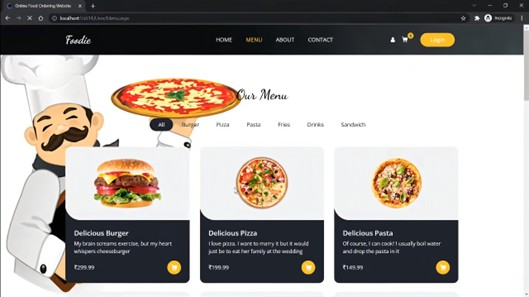
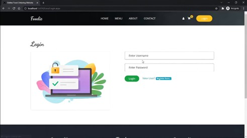
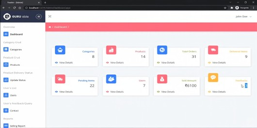
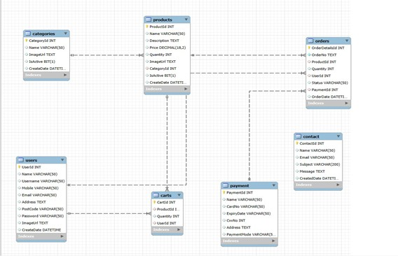

# Foodie - Online Food Ordering System


---

## Table of Contents
- [About](#about)
- [Features](#features)
- [Tech Stack](#tech-stack)
- [Project Structure](#project-structure)
- [Prerequisites](#prerequisites)
- [Installation & Setup](#installation--setup)
- [Database Configuration](#database-configuration)
- [Usage](#usage)
- [Admin Credentials](#admin-credentials)
- [Screenshots](#screenshots)
- [Contributing](#contributing)
- [License](#license)

---

## About

**Foodie** is a full-featured online food ordering system built with **ASP.NET Web Forms** and **MySQL**. The application provides a complete platform for customers to browse food items, place orders, and for administrators to manage the entire food ordering system including categories, products, and orders.

This project demonstrates:
- ASP.NET Web Forms architecture with Master Pages
- MySQL database integration with stored procedures
- CRUD operations with data validation
- Image upload and management
- Responsive UI with Bootstrap
- Admin dashboard with DataTables
- Session management and authentication

---

## Features

### User Features
- Browse food menu by categories
- View detailed food item information
- Responsive and modern UI design
- Special offers and promotions section
- About and Contact pages
- Customer testimonials section
- Shopping cart functionality

### Admin Features
- Secure admin login system
- Dashboard with statistics
- Category management (Add, Edit, Delete)
- Product management with image upload
- Order management system
- DataTables integration for data display
- Image validation (.jpg, .jpeg, .png)
- Active/Inactive status toggle

---

## Tech Stack

### Backend
- **Framework:** ASP.NET Web Forms (.NET Framework 4.8)
- **Language:** C# 
- **Database:** MySQL 9.3.0
- **ORM/Data Access:** ADO.NET with MySql.Data connector
- **Architecture:** Code-behind pattern with Master Pages

### Frontend
- **HTML5 & CSS3**
- **Bootstrap 4** - Responsive framework
- **JavaScript & jQuery 3.4.1**
- **Font Awesome** - Icons
- **Custom CSS** - Styling

### Admin Dashboard
- **DataTables** - Advanced table plugin
- **Morris.js** - Charts and graphs
- **AmCharts** - Data visualization
- **jQuery UI** - Enhanced UI components
- **Bootstrap Admin Template**

### NuGet Packages
```xml
- MySql.Data (9.3.0)
- BouncyCastle.Cryptography (2.5.1)
- Google.Protobuf (3.30.0)
- System.Configuration.ConfigurationManager (8.0.0)
- Microsoft.CodeDom.Providers.DotNetCompilerPlatform (2.0.1)
```

---

## Project Structure

```
Online-Food-Ordering-System-main/
│
├── Admin/                          # Admin panel pages
│   ├── Admin.Master               # Admin master page
│   ├── Dashboard.aspx             # Admin dashboard
│   ├── Category.aspx              # Category management
│   └── *.cs files                 # Code-behind files
│
├── User/                           # User-facing pages
│   ├── User.Master                # User master page
│   ├── Default.aspx               # Homepage
│   ├── Menu.aspx                  # Food menu page
│   ├── About.aspx                 # About page
│   ├── Contact.aspx               # Contact page
│   ├── SliderUserControl.ascx     # Slider component
│   └── *.cs files                 # Code-behind files
│
├── TemplateFiles/                  # Frontend assets
│   ├── css/                       # Stylesheets
│   ├── js/                        # JavaScript files
│   ├── images/                    # Template images
│   └── fonts/                     # Font files
│
├── assets/                         # Admin dashboard assets
│   ├── css/                       # Admin styles
│   ├── js/                        # Admin scripts
│   ├── datatables/                # DataTables plugin
│   ├── images/                    # Admin images
│   └── icon/                      # Icon fonts
│
├── Images/                         # Uploaded images
│   └── Category/                  # Category images
│
├── Connection.cs                   # Database connection class
├── Global.asax                     # Application events
├── Web.config                      # Configuration file
├── packages.config                 # NuGet packages
└── Foodie.csproj                  # Project file
```

---

## Prerequisites

Before running this project, ensure you have the following installed:

- **Visual Studio 2019/2022** (Community, Professional, or Enterprise)
- **.NET Framework 4.8 SDK**
- **MySQL Server 8.0+** (or MySQL 5.7+)
- **MySQL Workbench** (optional, for database management)
- **IIS Express** (comes with Visual Studio)
- **Web Browser** (Chrome, Firefox, Edge)

---

## Installation & Setup

### Step 1: Clone the Repository
```bash
git clone https://github.com/yourusername/Online-Food-Ordering-System.git

```

### Step 2: Restore NuGet Packages
1. Open the solution in Visual Studio
2. Right-click on the solution in Solution Explorer
3. Select **"Restore NuGet Packages"**
4. Wait for all packages to download

### Step 3: Configure MySQL Connection
1. Open `Web.config` file
2. Locate the `<connectionStrings>` section
3. Update the connection string with your MySQL credentials:

```xml
<connectionStrings>
  <add name="cs" 
       connectionString="Server=localhost;Database=foodiedb;Uid=root;Pwd=YourPassword;" 
       providerName="MySql.Data.MySqlClient" />
</connectionStrings>
```

**Parameters:**
- `Server`: MySQL server address (default: localhost)
- `Database`: Database name (default: foodiedb)
- `Uid`: MySQL username (default: root)
- `Pwd`: Your MySQL password

---

## Database Configuration

### Step 1: Create Database
Open MySQL Workbench or MySQL command line and execute:

```sql
CREATE DATABASE foodiedb;
USE foodiedb;
```

### Step 2: Create Tables

#### Categories Table
```sql
CREATE TABLE Category (
    CategoryId INT AUTO_INCREMENT PRIMARY KEY,
    Name VARCHAR(100) NOT NULL,
    ImageUrl VARCHAR(500),
    IsActive BOOLEAN DEFAULT TRUE,
    CreatedDate DATETIME DEFAULT CURRENT_TIMESTAMP
);
```

#### Products Table (if applicable)
```sql
CREATE TABLE Products (
    ProductId INT AUTO_INCREMENT PRIMARY KEY,
    Name VARCHAR(100) NOT NULL,
    Description TEXT,
    Price DECIMAL(10,2) NOT NULL,
    ImageUrl VARCHAR(500),
    CategoryId INT,
    IsActive BOOLEAN DEFAULT TRUE,
    CreatedDate DATETIME DEFAULT CURRENT_TIMESTAMP,
    FOREIGN KEY (CategoryId) REFERENCES Category(CategoryId)
);
```

### Step 3: Create Stored Procedure

```sql
DELIMITER $$

CREATE PROCEDURE Category_Crud(
    IN Action VARCHAR(20),
    IN CategoryId INT,
    IN Name VARCHAR(100),
    IN IsActive BOOLEAN,
    IN ImageUrl VARCHAR(500)
)
BEGIN
    IF Action = 'INSERT' THEN
        INSERT INTO Category (Name, ImageUrl, IsActive, CreatedDate)
        VALUES (Name, ImageUrl, IsActive, NOW());
        
    ELSEIF Action = 'UPDATE' THEN
        UPDATE Category 
        SET Name = Name,
            IsActive = IsActive,
            ImageUrl = IFNULL(ImageUrl, Category.ImageUrl)
        WHERE CategoryId = CategoryId;
        
    ELSEIF Action = 'DELETE' THEN
        DELETE FROM Category WHERE CategoryId = CategoryId;
        
    ELSEIF Action = 'GETBYID' THEN
        SELECT * FROM Category WHERE CategoryId = CategoryId;
        
    ELSEIF Action = 'SELECT' THEN
        SELECT * FROM Category ORDER BY CreatedDate DESC;
    END IF;
END$$

DELIMITER ;
```

### Step 4: Insert Sample Data (Optional)
```sql
INSERT INTO Category (Name, ImageUrl, IsActive) VALUES
('Pizza', 'Images/Category/pizza.jpg', TRUE),
('Burgers', 'Images/Category/burger.jpg', TRUE),
('Pasta', 'Images/Category/pasta.jpg', TRUE),
('Desserts', 'Images/Category/dessert.jpg', TRUE);
```

---

## Usage

### Running the Application

1. **Open the project** in Visual Studio
2. **Set the startup page:**
   - Right-click on `User/Default.aspx`
   - Select **"Set As Start Page"**
3. **Press F5** or click the **"IIS Express"** button to run
4. The application will open in your default browser at `http://localhost:52995/`

### Accessing Admin Panel

1. Navigate to: `http://localhost:52995/Admin/Dashboard.aspx`
2. Enter admin credentials (see below)
3. Manage categories, products, and orders

---

## Admin Credentials

Default admin credentials are configured in `Web.config`:

```
Username: Admin
Password: 123
```

**Security Note:** Change these credentials in production! Update the values in `Web.config`:

```xml
<appSettings>
  <add key="username" value="Admin" />
  <add key="password" value="123" />
</appSettings>
```

---

## Screenshots

### User Interface

#### Homepage


#### Menu Page


### Admin Panel

#### Admin Login


#### Admin Dashboard


### Database Schema


---

## Troubleshooting

### Common Issues

**1. MySQL Connection Error**
- Verify MySQL service is running
- Check connection string in `Web.config`
- Ensure database `foodiedb` exists

**2. NuGet Package Errors**
- Clean and rebuild solution
- Delete `packages` folder and restore
- Update NuGet Package Manager

**3. Image Upload Issues**
- Ensure `Images/Category/` folder exists
- Check folder permissions (Read/Write)
- Verify file extensions (.jpg, .jpeg, .png)

**4. Build Errors**
- Target framework must be .NET Framework 4.8
- Ensure all NuGet packages are restored
- Clean solution and rebuild

---

## Contributing

Contributions are welcome! Please follow these steps:

1. Fork the repository
2. Create a feature branch (`git checkout -b feature/AmazingFeature`)
3. Commit your changes (`git commit -m 'Add some AmazingFeature'`)
4. Push to the branch (`git push origin feature/AmazingFeature`)
5. Open a Pull Request

---

## Future Enhancements

- [ ] User authentication and registration
- [ ] Shopping cart and checkout system
- [ ] Payment gateway integration
- [ ] Order tracking system
- [ ] Email notifications
- [ ] Product reviews and ratings
- [ ] Search and filter functionality
- [ ] Wishlist feature
- [ ] Mobile app integration

---

## License

This project is licensed under the MIT License - see the [LICENSE](LICENSE) file for details.

---

## Author

**Paramnoor Singh**
- GitHub: [@yourusername](https://github.com/ParamnoorSingh15)
- LinkedIn: [Your LinkedIn](https://linkedin.com/in/paramnoor-singh-40083b291)

---

## Acknowledgments

- Bootstrap for the responsive framework
- DataTables for advanced table features
- Font Awesome for icons
- MySQL for database management
- ASP.NET community for resources and support

---

## Support

If you encounter any issues or have questions:
- Open an issue on GitHub
- Contact: your.email@example.com

---

<div align="center">
  <p>Made with ❤️ using ASP.NET and MySQL</p>
  <p>⭐ Star this repository if you find it helpful!</p>
</div>
